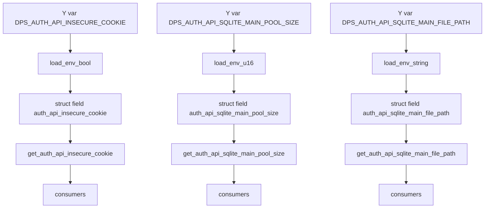

# Plan: Update DpsAuthApi configuration

## Breaking Changes

**BREAKING:** The property `auth_api_sqlite_file_path` has been renamed to `auth_api_sqlite_main_file_path`. This affects:
- Struct field name
- Getter method: `get_auth_api_sqlite_file_path()` → `get_auth_api_sqlite_main_file_path()`
- Setter method: `set_auth_api_sqlite_file_path()` → `set_auth_api_sqlite_main_file_path()`
- Environment variable: `DPS_AUTH_API_SQLITE_FILE_PATH` → `DPS_AUTH_API_SQLITE_MAIN_FILE_PATH`
- Default value changed from `data/development.db` → `data/main-development.db`

Consumers must update their code to use the new property name and environment variable.

## Scope
- Add boolean property auth_api_insecure_cookie with default false and env var DPS_AUTH_API_INSECURE_COOKIE
- Add integer property auth_api_sqlite_main_pool_size with type u16, default 1, env var DPS_AUTH_API_SQLITE_MAIN_POOL_SIZE
- Rename auth_api_sqlite_file_path to auth_api_sqlite_main_file_path, update env var to DPS_AUTH_API_SQLITE_MAIN_FILE_PATH, update getter and setter
- Update tests for new and renamed properties
- Update documentation

References
- Code: src/lib.rs
- Docs: README.md

Compatibility
- No backward-compatibility with old env var DPS_AUTH_API_SQLITE_FILE_PATH
- Breaking rename for getter and setter from auth_api_sqlite_file_path to auth_api_sqlite_main_file_path

Files to modify
- src/lib.rs
- README.md

Validation
- Run tests using mise exec -- cargo test

Mermaid


Implementation details

1) Add struct fields in src/lib.rs
- Add:
  - auth_api_insecure_cookie: Option<bool>
  - auth_api_sqlite_main_pool_size: Option<u16>
  - auth_api_sqlite_main_file_path: Option<String>
- Remove old field:
  - auth_api_sqlite_file_path

2) Update DpsConfig::new environment loading in src/lib.rs
- Add loads:
  - auth_api_insecure_cookie: load_env_bool("DPS_AUTH_API_INSECURE_COOKIE")
  - auth_api_sqlite_main_pool_size: load_env_u16("DPS_AUTH_API_SQLITE_MAIN_POOL_SIZE")
  - auth_api_sqlite_main_file_path: load_env_string("DPS_AUTH_API_SQLITE_MAIN_FILE_PATH")
- Remove:
  - load for DPS_AUTH_API_SQLITE_FILE_PATH
- Update doc comment list of env vars to include the two new ones and the renamed path

3) Add getters and setters in src/lib.rs

Rust code samples

Add fields on DpsConfig
```rust
// in struct DpsConfig
auth_api_insecure_cookie: Option<bool>,
auth_api_sqlite_main_pool_size: Option<u16>,
auth_api_sqlite_main_file_path: Option<String>,
```

Load from env in new
```rust
// in DpsConfig::new
auth_api_insecure_cookie: load_env_bool("DPS_AUTH_API_INSECURE_COOKIE"),
auth_api_sqlite_main_pool_size: load_env_u16("DPS_AUTH_API_SQLITE_MAIN_POOL_SIZE"),
auth_api_sqlite_main_file_path: load_env_string("DPS_AUTH_API_SQLITE_MAIN_FILE_PATH"),
```

Getters and setters
```rust
// auth_api_insecure_cookie, default false
pub fn get_auth_api_insecure_cookie(&self) -> bool {
    self.auth_api_insecure_cookie.unwrap_or(false)
}
pub fn set_auth_api_insecure_cookie(&mut self, value: bool) {
    self.auth_api_insecure_cookie = Some(value);
}

// auth_api_sqlite_main_pool_size, default 1
pub fn get_auth_api_sqlite_main_pool_size(&self) -> u16 {
    self.auth_api_sqlite_main_pool_size.unwrap_or(1)
}
pub fn set_auth_api_sqlite_main_pool_size(&mut self, value: Option<u16>) {
    self.auth_api_sqlite_main_pool_size = value;
}

// auth_api_sqlite_main_file_path, default data/main-development.db
pub fn get_auth_api_sqlite_main_file_path(&self) -> String {
    self.auth_api_sqlite_main_file_path
        .clone()
        .unwrap_or_else(|| "data/main-development.db".to_string())
}
pub fn set_auth_api_sqlite_main_file_path(&mut self, value: &str) {
    self.auth_api_sqlite_main_file_path = Some(value.to_string());
}
```

Remove old API
- Remove get_auth_api_sqlite_file_path and set_auth_api_sqlite_file_path
- Replace all internal references with the new names

4) Tests in src/lib.rs

Update existing default test
- Assert defaults for new and renamed properties:
  - get_auth_api_insecure_cookie() returns false
  - get_auth_api_sqlite_main_pool_size() returns 1
  - get_auth_api_sqlite_main_file_path() returns data/main-development.db

Add env var tests
```rust
#[test]
fn test_auth_api_insecure_cookie_env() {
    std::env::set_var("DPS_AUTH_API_INSECURE_COOKIE", "Y");
    let c = DpsConfig::new();
    assert!(c.get_auth_api_insecure_cookie());
    std::env::remove_var("DPS_AUTH_API_INSECURE_COOKIE");
}

#[test]
fn test_auth_api_sqlite_main_pool_size_env() {
    std::env::set_var("DPS_AUTH_API_SQLITE_MAIN_POOL_SIZE", "8");
    let c = DpsConfig::new();
    assert_eq!(c.get_auth_api_sqlite_main_pool_size(), 8);
    std::env::remove_var("DPS_AUTH_API_SQLITE_MAIN_POOL_SIZE");
}

#[test]
fn test_auth_api_sqlite_main_file_path_default_and_setter() {
    let mut c = DpsConfig::new();
    assert_eq!(c.get_auth_api_sqlite_main_file_path(), "data/main-development.db");
    c.set_auth_api_sqlite_main_file_path("data/custom.db");
    assert_eq!(c.get_auth_api_sqlite_main_file_path(), "data/custom.db");
}
```

Update setter coverage
```rust
#[test]
fn test_auth_api_sqlite_main_pool_size_setter() {
    let mut c = DpsConfig::new();
    assert_eq!(c.get_auth_api_sqlite_main_pool_size(), 1);
    c.set_auth_api_sqlite_main_pool_size(Some(12));
    assert_eq!(c.get_auth_api_sqlite_main_pool_size(), 12);
    c.set_auth_api_sqlite_main_pool_size(None);
    assert_eq!(c.get_auth_api_sqlite_main_pool_size(), 1);
}
```

Remove or rename tests
- Replace any usage of get_auth_api_sqlite_file_path with get_auth_api_sqlite_main_file_path
- Replace any usage of set_auth_api_sqlite_file_path with set_auth_api_sqlite_main_file_path

5) README updates

Configuration table changes under DpsAuthApi
- Replace:
  - auth_api_sqlite_file_path with auth_api_sqlite_main_file_path
- Add rows:
  - auth_api_insecure_cookie with default false, DPS_AUTH_API_INSECURE_COOKIE
  - auth_api_sqlite_main_pool_size with default 1, DPS_AUTH_API_SQLITE_MAIN_POOL_SIZE
- Update defaults:
  - auth_api_sqlite_main_file_path default to data/main-development.db

Environment examples
```bash
# DpsAuthApi
export DPS_AUTH_API_INSECURE_COOKIE=Y          # optional, default is not set which means false
export DPS_AUTH_API_SQLITE_MAIN_POOL_SIZE=8    # optional, default 1
export DPS_AUTH_API_SQLITE_MAIN_FILE_PATH="data/main-development.db"
```

Usage examples
```rust
let mut c = DpsConfig::new();
assert!(!c.get_auth_api_insecure_cookie());
c.set_auth_api_insecure_cookie(true);
assert!(c.get_auth_api_insecure_cookie());

assert_eq!(c.get_auth_api_sqlite_main_pool_size(), 1);
c.set_auth_api_sqlite_main_pool_size(Some(4));
assert_eq!(c.get_auth_api_sqlite_main_pool_size(), 4);

assert_eq!(c.get_auth_api_sqlite_main_file_path(), "data/main-development.db");
c.set_auth_api_sqlite_main_file_path("data/prod.db");
assert_eq!(c.get_auth_api_sqlite_main_file_path(), "data/prod.db");
```

6) Release notes
- Breaking change rename auth_api_sqlite_file_path to auth_api_sqlite_main_file_path
- Add new properties auth_api_insecure_cookie and auth_api_sqlite_main_pool_size
- Recommend version bump as breaking change

Implementation checklist
- Update struct fields and env loads in src/lib.rs
- Implement new getters and setters
- Remove old getter and setter for sqlite file path
- Update default values
- Update tests for defaults, env vars, setters
- Update README tables and examples
- Run mise exec -- cargo test

Notes on integer type choice
- Pool size uses u16 per request
- Difference: u16 supports 0..65535, u32 supports 0..4294967295, usize matches pointer width and is often used for indices
- For connection pool sizes, u16 is sufficient and conservative

## Postmortem: Test Flakiness Investigation

Problem discovered
- Initial implementation had flaky tests that occasionally failed during parallel execution
- Failure manifested as: `assertion failed: !config.get_auth_api_insecure_cookie()` in test_default_values
- Reproduced using stress testing script (300 iterations)

Root cause analysis
- Tests that mutate process-wide environment variables (std::env::set_var/remove_var) ran in parallel
- test_default_values depends on absence of env vars and reads them at config creation time
- Race condition: when test_auth_api_insecure_cookie sets DPS_AUTH_API_INSECURE_COOKIE="Y", test_default_values could run concurrently and read the modified env, causing assertion failure
- Same issue affected: test_auth_api_sqlite_main_pool_size, test_auth_api_sqlite_main_file_path, test_auth_api_session_ttl_seconds

Investigation artifacts (preserved for reference)

catch_flaky_test.sh:
```bash
# Clear the log file before starting
> test_errors.log

for i in {1..300}; do
    # 1. Add '-- --nocapture' to get immediate, detailed test output on stderr.
    # 2. Redirect successful stdout noise to /dev/null.
    # 3. Append the stderr (which now contains rich errors) to our log file.
    mise exec -- cargo test -- --nocapture > /dev/null 2>> test_errors.log || {
        echo "Error on run #$i. Full test failure output is in test_errors.log"
        # Optional: Print the log file to the console immediately
        cat test_errors.log
        exit 1
    }
done && echo "All 300 test runs passed successfully!"
```

Sample failure from test_errors.log:
```
thread 'tests::test_default_values' (1283954) panicked at src/lib.rs:334:5:
assertion failed: !config.get_auth_api_insecure_cookie()
```

Solution implemented
- Added serial_test = "3" dev dependency to Cargo.toml
- Imported use serial_test::serial in test module
- Marked 5 env-sensitive tests with #[serial] attribute:
  - test_default_values (depends on clean environment)
  - test_auth_api_insecure_cookie (sets DPS_AUTH_API_INSECURE_COOKIE)
  - test_auth_api_sqlite_main_pool_size (sets DPS_AUTH_API_SQLITE_MAIN_POOL_SIZE)
  - test_auth_api_sqlite_main_file_path (sets DPS_AUTH_API_SQLITE_MAIN_FILE_PATH)
  - test_auth_api_session_ttl_seconds (sets DPS_AUTH_API_SESSION_TTL_SECONDS)

Validation results
- Ran catch_flaky_test.sh after fix: 300/300 test runs passed
- No failures detected across 300 iterations
- Tests now run reliably in both parallel and serial modes

Lessons learned
- Process-wide environment variables are inherently not thread-safe in Rust tests
- Tests that mutate global state require serialization
- serial_test provides minimal, targeted serialization without forcing all tests to run single-threaded
- Stress testing (300+ iterations) is effective for catching rare race conditions